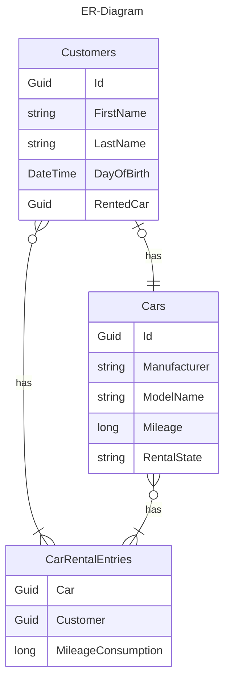

# Ferchau - Car rental

## Software architecture

The application is inspired by the [Clean Architecture](https://blog.cleancoder.com/uncle-bob/2012/08/13/the-clean-architecture.html) and is build like following:

1. The `Zeruxky.Ferchau` project is the hosting project to wire all pieces together and start the application.
2. The `Zeruxky.Ferchau.Application` contains the `commands` and `queries` to change the state of the application, by applying a command, or by receiving data from the application, by using a query. This patterns is also called `Command and Query Responsibility Segregation (CQRS)`. I'm using [MediatR](https://github.com/jbogard/MediatR) to achieve this.
3. The `Zeruxky.Ferchau.Domain` is the heart of the application. It contains the business logic and the classes that represents the whole problem. An example of business logic can be, that a customer can not rent a car that is already rented or that a customer can not return a car which is not rented. This layer should be covered by a high amount of tests.
4. The `Zeruxky.Ferchau.Persistence` contains data about the persistence of the applications state. Here I use [Entity Framework Core](https://learn.microsoft.com/en-us/ef/core/) as an ORM-Mapper and as the accessor to my database. For the database storage I used SQLite, but it can be replaced easily with any Entity Framework Core DB-Provider (e.g. MSSQL, MariaDB). Entity Framework Core also builds the necessary relationships between the different tables. The relationships are defined as follows:



The `Customers` table contains the data about the customer itself. To identify the customer a Guid will automatically assigned when the customer is created. The customer has a link to the rented car, if he has rented one.

The `Cars` table contains the data about the car itself. The car is also identified by a Guid, that is assigned automatically at creation.

The `CarRentalEntries` table contains every single rent of a car. It contains the identifier of the rented car, the customer that has rented the car and the used mileage consumption.

5. The `Zeruxky.Ferchau.Web` contains all related APIs to the web. Currently there is only the API that is hosted by the application. The definition of the API is served by OpenAPI/Swagger and is rendered as a graphical UI to try every single endpoint. This is achieved by the usage of [Swashbuckle](https://github.com/domaindrivendev/Swashbuckle.AspNetCore) and [FastEndpoints](https://fast-endpoints.com/). Swashbuckle generates the swagger JSON based on the configuration and documentation of each Endpoint class and renders a UI which represents the generated swagger JSON. FastEndpoints provides us the possibility to use the [Request-Endpoint-Response (REPR)](https://deviq.com/design-patterns/repr-design-pattern) design pattern. Shortly described, the REPR allows us to keep the endpoint classes small and easy to maintain. A real frontend was not possible, because of the short time period, but my idea was to use .NET Blazor as the frontend technology. The frontend gets the data from the hosted API and is only responsible for rendering the received data.

I used mainly C\# as my programming language and .NET 8. This is my daily driver at work and the environment which I'm confident. Some packages like FastEndpoints and Entity Framework Core are used, because I want to use them long time ago and think this is a perfect playground for it. The database is SQLite because it's simple and easy to install. Firstly I wanted to go with MSSQL and MSSQL LocalDb, but it got to complicated for the available amount of time. So SQLite was my second choice for the database storage.

Also I wanted to provide a docker image of this application to simplify the setup of the application, but there was not enough time to finish the docker integration. 

## Prerequisites

- At minimum .NET 8 SDK and runtime.
- Optionally a IDE like Visual Studio, Visual Studio Code or Jetbrains Rider.
- Any webbrowser to access the API.

## Build

1. Clone the repository to your local system.
2. Navigate to the folder where you cloned the repository.
3. (Optionally) Open the solutions in your IDE by clicking the `Zeruxky.Ferchau.sln`.
4. Run the build with your IDE or execute the following command in a command line / powershell at the repository's directory

```bash
> dotnet build
```

## Run application

To run the application you can either run it from your IDE of your choice or by executing the produced executable file at `./Zeruxky.Ferchau/Debug/net8.0` in a command line / powershell with the following command

```bash
> ./Zeruxky.Ferchau.exe
```

The API is hosted at [http:localhost:5000/swagger](http:localhost:5000/swagger) where you can find some API endpoints, which you can try out, but long story short, they don't fully function because of the incomplete configuration of Entity Framework Core.